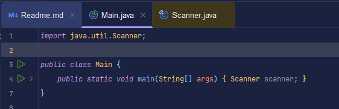
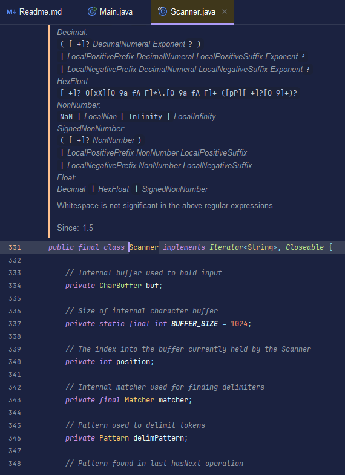
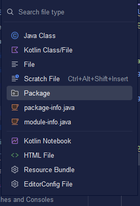
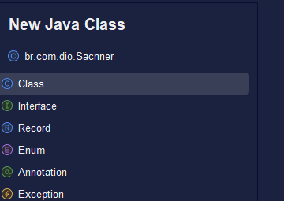
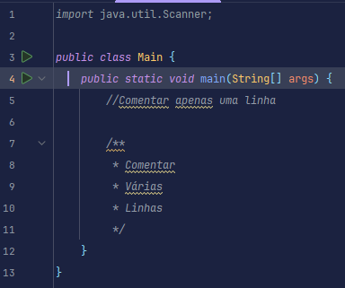
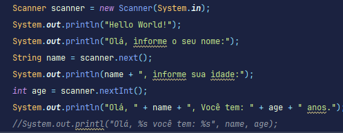
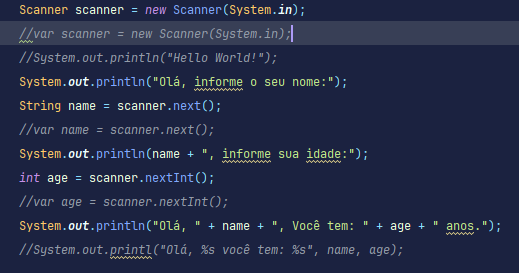

<div align="center">

# Documentação de Estudos: Java & IDE


</div>

---
## 🧭 Padrões de desenvolvimento e conceitos



> **Dica de Produtividade:** Para inspecionar a implementação interna ou visualizar o **Javadoc** de uma classe/método, segure a tecla `CTRL` e clique sobre o nome do elemento.



---

## 📦 Estrutura e Nomenclatura de Pacotes (Packages)



Seguindo as convenções oficiais de Java, utilizamos o **domínio da organização invertido** para garantir a unicidade do pacote.

### Exemplo Prático:


---

## ☕ Criação de Classes no Contexto do Pacote




---

## 📝 Comentários e Documentação (Javadoc)

Exemplos de boas práticas para comentar código.



---

## 💬 Interação com o Usuário (Output)



> **Nota:** O código acima demonstra diferentes abordagens para concatenação de Strings e exibição de dados no console.

---

## 🔧 Declaração com Inferência de Tipo (`var`)

Exemplo de uso da keyword `var` (disponível a partir do Java 10), onde o compilador infere o tipo da variável com base na instância atribuída.



```java
// Exemplo: O compilador entende automaticamente que é um Scanner
// var scanner = new Scanner(System.in);
```

----

## Keywords e tipos primitvos
